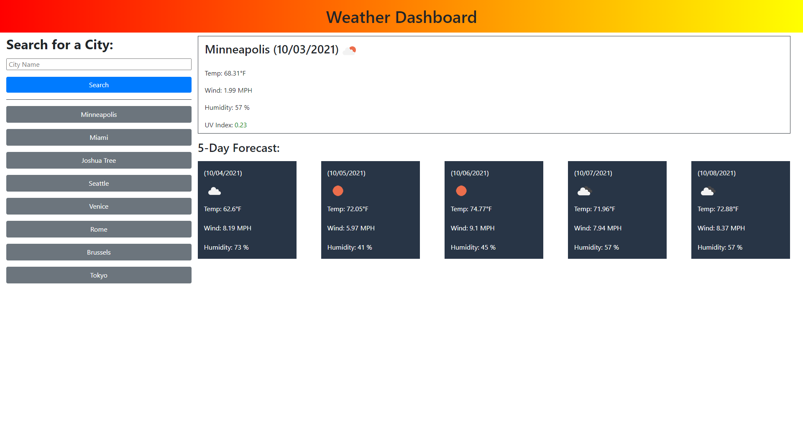

# Weather Dashboard 

## Purpose
A user may search for a city in the search box. When searched, it will provide todays date, weather, temperature, wind, humidity, and UV index in the main box. It will also provide the next 5 day's date, weather, temperature, wind, and humidity. It will then save that city as a button that is able to be easily pressed on the side, up to 8 cities.

## Project Details
This project was to practice and demonstrate the understanding and usage of server-side API's and make fetch calls to gather and render data. The fetch calls are nested so that a city may be searched and data from that respose is passed into another fetch call that will provide current weather details and a five day forecast, while saving the city on the side for ease of access.

## Built With
* HTML
* CSS
* JavaScript
* Moment.js
* JQuery
* Bootstrap
* Server-Side API's

## Website
https://ahmed-sajjad111.github.io/weather-dashboard/

## Preview

## Contribution
Made by [Ahmed Sajjad]